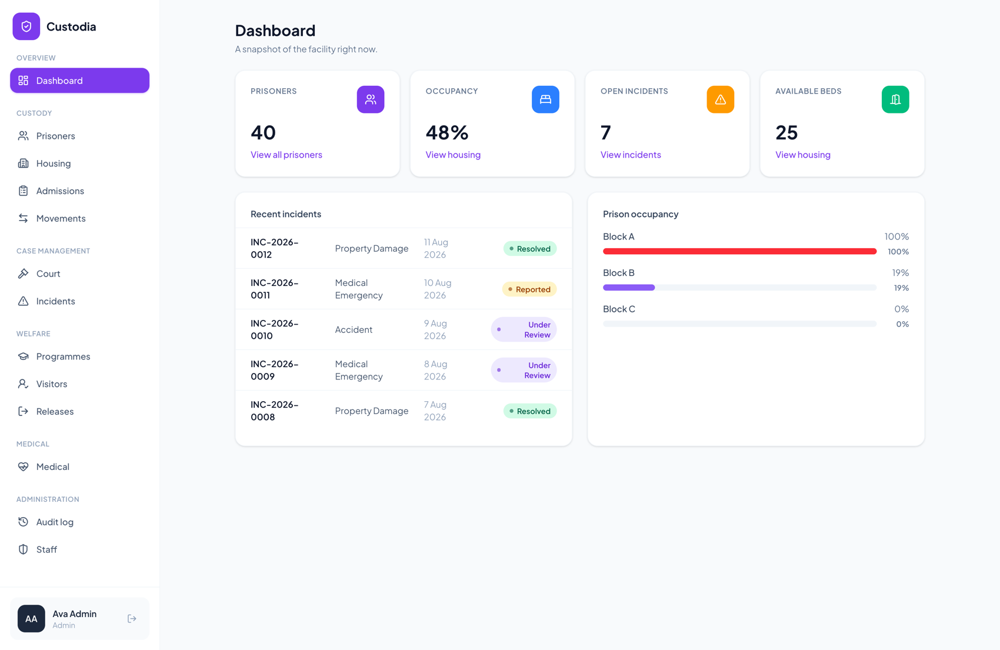
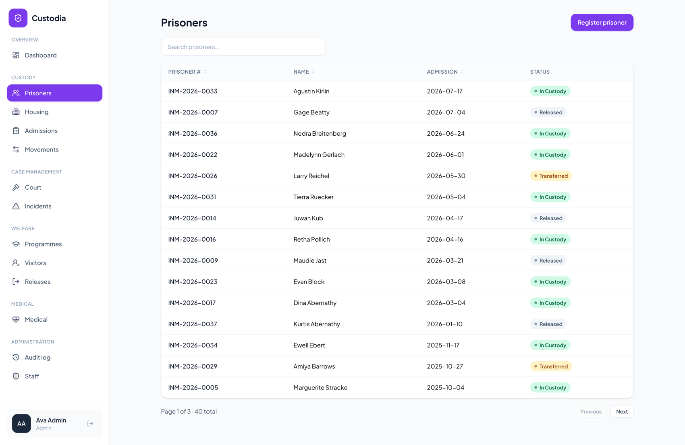
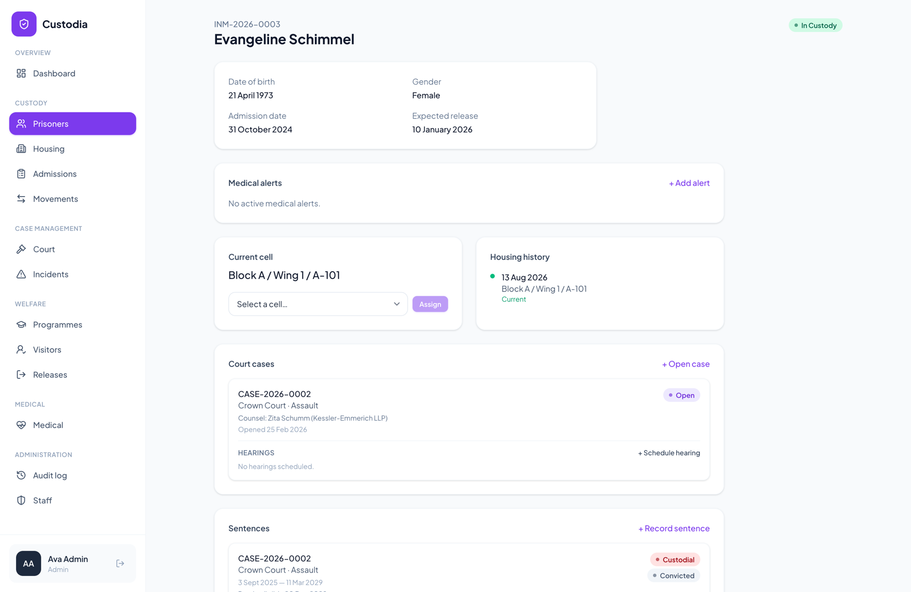
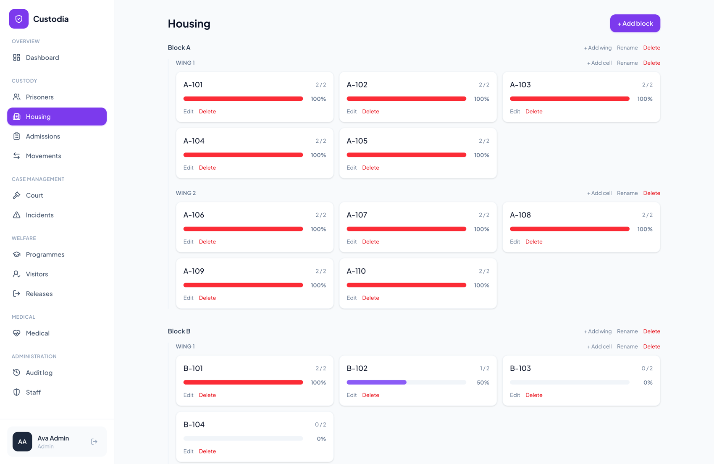
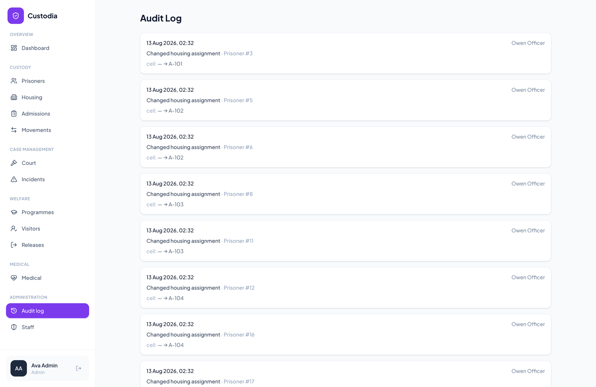

# Custodia — Prison Management System

A custody and welfare management system for a correctional facility. It covers admissions,
housing, sentences, court cases, medical care, visits, movements and releases, and keeps an
audit trail of every action taken in it.

**Live demo: [custodia-rsvq.onrender.com](https://custodia-rsvq.onrender.com)** — sign in with
`admin@demo.com` / `password`, or use one of the other roles further down. It's on a free
instance that sleeps when idle, so the first request after a quiet spell takes a moment.



| | |
|---|---|
|  |  |
| Searchable, sortable prisoner list | A prisoner profile with case, sentence and housing panels |
|  |  |
| Block, wing and cell occupancy | The audit trail, showing before and after values |

Everything above is the demo dataset from `php artisan migrate --seed`, so a fresh clone looks
like this too.

## Why I built this

This one comes from how prisons are run back home.

Most Nigerian correctional facilities still keep their records on paper. Custody registers,
case files, court dates, property receipts: all of it handwritten into ledgers and folders.
On top of that, the facilities are badly overcrowded, and a large share of the people inside
are awaiting trial rather than serving a sentence, so the population is constantly churning.

The result is that nobody can reliably answer basic questions about who is in the building.
People get held past their release date because the document proving the date has gone
missing. Court appearances get missed. Transfers happen without any record of who approved
them. You don't need anyone to be acting in bad faith for this to happen. A paper system just
has no way of noticing when something has gone wrong.

That's the kind of problem software is genuinely good at, so I wanted to see what a serious
attempt at it would look like. The features here were chosen to close specific gaps rather
than to pad out a feature list:

- Every change writes an audit entry (who, what, before and after) in the same database
  transaction as the change itself, so the record can't survive without the change or vice versa.
- An admission can't move past intake until someone records the legal authority for holding
  the person. Sentences store the court, offence, legal status and parole eligibility date.
- Releases go through a five-step review covering legal status, sentence, property and
  documentation, and the last step is a supervisor approval that officers can't perform.
- Occupancy is counted live from active assignments, so overcrowding is visible per cell, wing
  and block instead of surfacing only when a cell is obviously full.
- Medical records sit behind a Medical role. Officers and supervisors see the operational
  alerts they need to work safely and nothing clinical.

It's a portfolio project and I'm not pretending otherwise, but the constraints I designed
against are real.

## Stack

- Laravel 13 (API) with Laravel Sanctum for SPA cookie auth
- Vue 3, TypeScript, Vue Router and Pinia, served through a single Blade shell via Vite
- PostgreSQL
- Tailwind CSS 4 with `@tailwindcss/forms`, and Lucide icons
- Docker, optionally (see below)

## What's in it

Custody is the core of it. Admissions run as a staged intake: create the prisoner record,
record the legal authority, do an initial assessment, set a security classification, complete
a medical screening, assign housing. Each stage has to be finished before the next opens up,
and the medical screening can only be signed off by medical staff. Prisoners can be
registered, searched, viewed and archived. The estate is modelled as Facility → Block → Wing →
Cell, with occupancy derived from active assignments so it can't fall out of sync. Housing
assignments are stored as a history table with `started_at` and `ended_at` rather than a
single `cell_id` column on the prisoner, which means every prisoner has a full cell timeline.
Movements handle transfers and escorts through a requested → approved → departed → arrived →
returned lifecycle, and property is logged in at intake and signed out on discharge.

For case management there are sentences (case number, court, offence, dates, type, parole
eligibility, legal status), court cases with their hearings and legal representatives, and
incident reporting that moves from reported to under review to resolved.

The welfare side covers medical records, appointments, prescriptions and alerts, all
restricted to the Medical role. Rehabilitation programmes track enrolment and attendance.
Visits work off a shared visitor registry: a request needs supervisor approval before it
becomes a scheduled visit, is rejected outright if the visitor is banned, and officers handle
check-in and check-out at the desk. Releases run the five-step review described above.

Oversight is a dashboard with population, occupancy, open incidents and available beds, plus
the audit log.

## Roles

| Role | Can do |
|---|---|
| Admin | Everything, including staff management |
| Officer | Day-to-day custody work: admissions, housing, incidents, property, visits |
| Supervisor | Review and sign-off: incident resolution, visit approval, movement and release approval |
| Medical | Clinical records, appointments, prescriptions, and the admission medical screening |

## Demo accounts

Seeded by `php artisan db:seed`. The password for all of them is `password`.

| Role | Email |
|---|---|
| Admin | admin@demo.com |
| Officer | officer@demo.com |
| Supervisor | supervisor@demo.com |
| Medical | medical@demo.com |

## Local setup (no Docker)

You'll need PHP 8.4+, Composer, Node 22+, and a local PostgreSQL instance.

```bash
composer install
npm install

cp .env.example .env
php artisan key:generate
```

Create the database and a role for it, picking your own password:

```bash
psql -U postgres -c "CREATE ROLE custodia WITH LOGIN PASSWORD 'choose-a-password' CREATEDB;"
psql -U postgres -c "CREATE DATABASE custodia OWNER custodia;"
psql -U postgres -c "CREATE DATABASE custodia_test OWNER custodia;"
```

Put that password into `.env` along with the rest of the connection details (`DB_HOST`,
`DB_PORT`, `DB_DATABASE`, `DB_USERNAME`, `DB_PASSWORD`). The test suite reuses the same role
and reads it from `.env` too, so there's nothing extra to configure. `phpunit.xml` only
overrides the database name so tests can't touch your development data.

Migrate and seed:

```bash
php artisan migrate --seed
```

Then start Laravel and Vite together:

```bash
composer run dev
```

The app is at `http://localhost:8010`. One thing worth knowing: `SANCTUM_STATEFUL_DOMAINS` in
`.env` has to include whatever host and port you're actually serving on
(`localhost:8010,127.0.0.1:8010` by default). If it doesn't, Sanctum's cookie auth fails
silently and you'll spend a while wondering why login does nothing.

## Deploying

There's a `render.yaml` blueprint for Render. In the dashboard pick New > Blueprint, point it
at this repo, and it creates the Postgres database and the web service together.

Two values need setting by hand afterwards:

- `APP_KEY`, from `php artisan key:generate --show`. Keep the `base64:` prefix.
- `APP_URL`, set to `https://<your-service>.onrender.com` once Render has assigned the domain.

`SANCTUM_STATEFUL_DOMAINS` is wired to the service's own hostname in the blueprint, because
getting it wrong is the failure where login does nothing and reports no error.

The blueprint only declares free resources, so it doesn't ask for payment details.

The demo accounts below are public, so anyone signing in can change the data. Render's cron
jobs aren't free, so the nightly reset runs as a GitHub Action instead
(`.github/workflows/reset-demo.yml`), which wipes the database and reseeds it at 03:00 UTC. It
needs one repository secret, `RENDER_DATABASE_URL`, set to the External Database URL from the
Render dashboard. There's a `workflow_dispatch` trigger on it too, so you can reset on demand
from the Actions tab.

Worth knowing before you rely on it: Render's free databases are removed after a limited
trial period, and free web services sleep when idle, so the first request after a quiet spell
takes a while to wake. Check their current terms.

Vercel isn't a sensible target for this. It has no first-party PHP runtime, serverless gives
you a read-only filesystem, and you'd need an external Postgres anyway.

## Docker

There's also a `docker-compose.yml` for running the whole thing locally (Postgres plus the app
container, with the frontend built into the image).

Both `APP_KEY` and `DB_PASSWORD` have to be in the environment. Compose is set to fail with a
message rather than fall back to a default, so a password never ends up hardcoded in the file:

```bash
APP_KEY=$(php artisan key:generate --show) DB_PASSWORD='choose-a-password' docker compose up --build
```

Then seed it in another terminal:

```bash
docker compose exec app php artisan db:seed
```

This one runs on `http://localhost:8000`.

## Tests

```bash
./vendor/bin/pest
```

184 feature tests. They cover authentication and role permissions, prisoner CRUD, housing
assignment history, the admission and release workflows, incidents, medical access
restrictions, visits, movements and sentences. There's also a security regression suite
covering login throttling, cell capacity enforcement, workflow state guards and audit
integrity, which came out of an audit pass over the whole codebase.

Tests run against a dedicated `custodia_test` Postgres database configured in `phpunit.xml`
rather than SQLite, because the prisoner search uses Postgres's `ILIKE`.

## Architecture notes

Business logic lives in `app/Services/`, not in controllers or models. Sequential number
generation, status transitions and the close-old/open-new housing assignment swap all happen
there. Controllers authorize, call a service, and return a Resource. No controller touches
`AuditService` directly.

Each service method opens its own `DB::transaction()` and writes its audit entry inside it.
That's deliberate: if the audit write and the state change could commit separately, the log
would eventually start lying, which defeats the point of having one.

A few other decisions worth calling out. Housing assignments carry `started_at`/`ended_at` so
a prisoner's cell history is a query instead of something you have to reconstruct. Cell, wing
and block occupancy is counted from active assignments rather than stored on a column that
would need keeping in sync. Statuses and types are PHP backed enums cast on the model, so an
invalid state fails at the boundary instead of somewhere further in. Every endpoint returns an
API Resource, so the JSON shape is explicit and database columns don't leak into responses by
accident.
